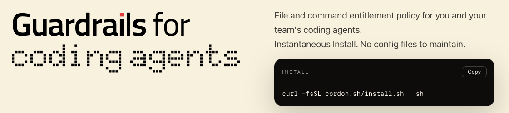

<p align="center">
  <a href="https://cordon.sh">
    
  </a>
</p>

<h3 align="center">
  <a href="https://cordon.sh">cordon.sh</a>
</h3>

<p align="center">
  Team-wide access policies and visibility for AI coding agents.
</p>

<p align="center">
  <a href="https://cordon.sh"></a>
  <a href="https://github.com/cordon-co/cordon-cli/releases/latest"></a>
  <a href="https://github.com/cordon-co/cordon-cli/actions/workflows/test.yml"></a>
  <a href="https://github.com/cordon-co/cordon-cli/actions/workflows/github-code-scanning/codeql"></a>
  <a href="LICENSE"></a>
  <a href="https://goreportcard.com/report/github.com/cordon-co/cordon-cli"></a>
  <a href="https://github.com/cordon-co/cordon-cli"></a>
</p>

---

## Supported Agents

| Agent | Support | Hook Based Enforcement | MCP Elicitation Support |
|-------|---------|------------------------|-------------------------|
|  Claude Code | First class | ✓ Yes | ✓ Yes |
|  Codex | First class | ✓ Yes | ✓ Yes |
|  Cursor | First class | ✓ Yes | ✓ Yes |
|  VS Code Chat (Copilot) | First class | ✓ Yes | ✓ Yes |
|  Gemini CLI | Effective | ✓ Yes | ⤫ No |
|  OpenCode | Effective | ✓ Yes | ⤫ No |

---

> [!NOTE]
> Upgrading from any version before `v0.6.x` may require deleting `~/.cordon/repos/` and/or `cordon uninstall && cordon init` in a repository to reset legacy databases.
> Database migrations and installation improvements are to be included from `v0.6.x` onward.

## Installation

**Quick install:**

```sh
curl -fsSL cordon.sh/install.sh | sh
```

**From GitHub directly:**

```sh
curl -fsSL https://raw.githubusercontent.com/cordon-co/cordon-cli/main/scripts/install.sh | sh
```

**Install a specific version:**

```sh
curl -fsSL https://raw.githubusercontent.com/cordon-co/cordon-cli/main/scripts/install.sh | CORDON_VERSION=v0.1.0 sh
```

**With Go (requires ~/go/bin on PATH):**

```sh
go install github.com/cordon-co/cordon-cli/cmd/cordon@latest
```

## Quick Start

**Initialise Cordon in your repository:**

```sh
cd your-repo
cordon init
```

The interactive setup will detect installed agents and let you select which ones to enforce policies on.

## Commands

```
cordon init           [-y|--yes] [--agent]
cordon uninstall
cordon status
cordon version

cordon log            [-i|--interactive]
                      [-f|--follow]
                      [--export csv]
                      [--since] [--until] [--date] [--limit]
                      [--agent] [--file] [--allow] [--deny] [--granted] [--pass]

cordon file list
cordon file add <pattern/path/folder/glob> [--allow] [--prevent-read]
cordon file remove <pattern/path/folder/glob>

cordon command list
cordon command add <command-pattern> [--allow] 
cordon command remove <command-pattern>

cordon pass list [--all]
cordon pass issue <pattern/path/folder/command> [--duration 60m|24h|7d|1w|indefinite]
cordon pass revoke <pass-id>
```

- All commands accept `--json` for structured output. Schemas not finalised at this time.

- `<pattern>` can be a file path, folder path, glob pattern, or command pattern.
Examples: `src/main.go`, `src/`, `**/*.env`, `git push *--force*`.
- File globs support recursive `**` matching.
- Command rules evaluate direct commands and common wrapped forms (for example `sh -c` and `bash -lc`).


## Documentation

- [CLI Reference](docs/cli-reference.md)
- [Project Overview and Concepts](docs/project-overview-and-concepts.md)

## Build

### Dev Build & Install (Standard development workflow)

```sh
./scripts/dev-install.sh
# installs to ~/.local/bin/cordon by default
# override with INSTALL_DIR=/usr/local/bin ./scripts/dev-install.sh
```

### Manual Build

```sh
# current platform
make build

# all release targets (darwin/linux/windows, arm64/amd64)
make build-all VERSION=1.0.0
```

- Binaries are written to `build/`.
- Cordon CLI is being built against Go 1.22+.

## Test

```sh
./scripts/test.sh
```

Runs both store-level unit tests and CLI integration tests.

## Auto Updates

When running `cordon` interactively (without `--json` and not in `--mcp` mode), the CLI performs a quick GitHub release check at most once every 24 hours.

- `~/.cordon/config.json` supports:
  - `skip_update_check` (`true`/`false`) to disable daily checks
  - `last_update_check` (RFC3339 timestamp), updated automatically after a check attempt
- If a newer release is detected, Cordon prompts:
  - `A new version of cordon-cli is available on github, install the update? [Y/n]:`
  - `Y` (or Enter) runs the installer script
  - `n` prints a reminder about `skip_update_check`

## Uninstallation

**1. Remove Cordon from a repository:**

```sh
cd your-repo
cordon uninstall
```

This removes the `.cordon/` directory and any agent hook configurations that were added by `cordon init`.

**2. Remove app data (optional):**

```sh
rm -rf ~/.cordon/
```

This removes credentials, cached policies, audit logs, and other local data.

**3. Remove the binary:**

If installed via the install script:

```sh
rm ~/.local/bin/cordon
# or /usr/local/bin/cordon if that's where it was installed
```

If installed via `go install`:

```sh
rm ~/go/bin/cordon
```

## License

[Business Source License 1.1](LICENSE) — see the LICENSE file for details.
